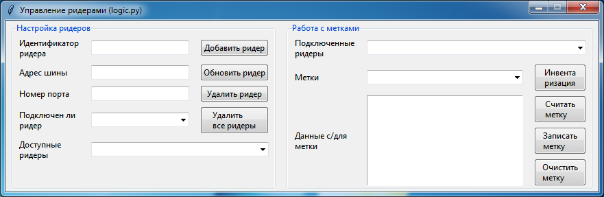

## RFID-модуль 

> В данный момент модуль находится в разработке

Подробная документация по модулю на Read the Docs: [RFID_module ](https://rfid-module.readthedocs.io/)

Модуль состоит из двух частей, написанных на языках C++ и Python. Модуль предоставляет возможность работы с RFID-оборудованием (ридером) через код, написанный на языке Python. Работа с ридерами осуществляется посредством HTTP-запросов по определённому API или через работу с `logic.py` как с обычным Python-модулем.

#### Структура проекта

#### Утилита с графическим интерфейсом для работы с ридерами

